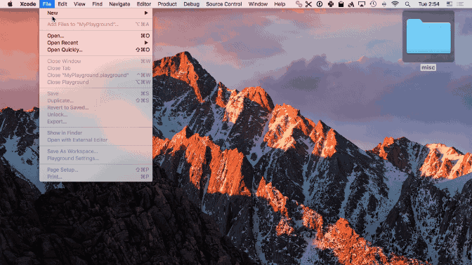
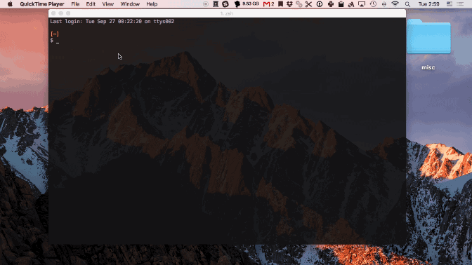

# Toybox

[](https://travis-ci.org/giginet/Toybox)
[](https://raw.githubusercontent.com/giginet/Toybox/master/LICENSE.md) 
[](https://github.com/giginet/Toybox/releases)
[](https://swift.org)


Toybox made easy to manage Xcode Playgrounds.

You can create and open Xcode Playground from CLI.

```
$ toybox create Snippet
# Generate ~/.toybox/Snippet.playground and open with Xcode
```

This product is under development so interfaces might change.

## Before Toybox



## Using Toybox



## Installation

Toybox requires High Sierra or above.

### Homebrew

```console
$ brew tap giginet/toybox https://github.com/giginet/Toybox.git
$ brew install giginet/toybox/toybox
$ toybox version
```

If you got error on tapping the formula. try `brew untap giginet/toybox` before.

### Mint

Install [yonaskolb/Mint](https://github.com/yonaskolb/Mint).

```console
$ mint install giginet/toybox
```

## Features

### Create new Playground

```sh
# Create 'UIKitDemo.playground' for iOS
$ toybox create UIKitDemo
# Create a new Playground which is not saved
$ toybox create
# Create a new auto generated named Playground which is saved like 20190404082446.playground
$ toybox create -s
# Create 'SpriteKit.playground' for macOS
$ toybox create SpriteKitDemo --platform macos
# Overwrite existing playground 'UIKitDemo'
$ toybox create UIKitDemo -f
# Create but don't open with Xcode
$ toybox create UIKitDemo --no-open
# Create and open with specific Xcode
$ toybox create UIKitDemo --xcode-path /Application/Xcode7.3.app
# Create Playground from standard input
$ echo 'print("Hello World")' | toybox create --input
```

Created Playgrounds will be saved under `$HOME/.toybox`

### List Playgrounds

```sh
# List all existing playgrounds
$ toybox list
# List all playgrounds of specific platform
$ toybox list --platform ios
```

### Open Playground

```sh
# Open UIKitDemo.playground with default Xcode
$ toybox open UIKitDemo
# Open UIKitDemo.playground with specific Xcode
$ toybox open UIKitDemo --xcode-path /Application/Xcode7.3.app
```

### Other

```sh
# Display current Toybox version
$ toybox version
# Display path to Toybox root directory,
# It should return '$HOME/.toybox'
$ toybox root
```

## Extra Usage

Open existing playgrouds with [peco](https://github.com/peco/peco)

```sh
toybox list | peco | awk '{print $1}' | xargs toybox open

```

## Development

```console
$ swift package generate-xcodeproj
$ open Toybox.xcodeproj
```

## Author

giginet <<giginet.net@gmail.com>>

## License

MIT License
